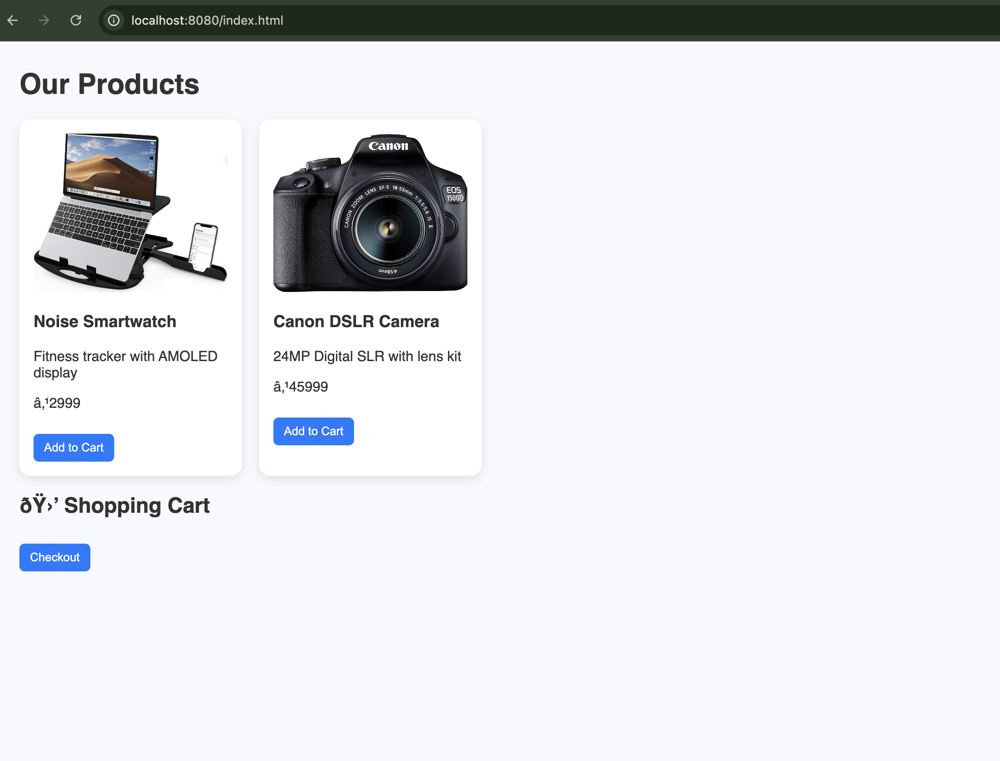

#  E-commerce Store – Spring Boot Application

This is a simple e-commerce web application built with **Java (Spring Boot)** for the backend and **HTML, CSS, JavaScript** for the frontend.

>  Features include product listing, product details, shopping cart, and order processing.

---

##  Tech Stack

- **Backend**: Java, Spring Boot, Spring Data JPA, H2 (in-memory DB)
- **Frontend**: HTML, CSS, JavaScript
- **Build Tool**: Maven
- **Database**: H2 Console (in-memory)
- **IDE**: VS Code

---

##  Screenshot



> 💡 If image doesn't show, make sure you’ve added the `screenshots/homepage.png` file and committed it.

---

##  Features

-  List all products on the homepage
-  View product details
-  Add to cart (static cart in UI)
-  Simulate order placement
- � Basic responsive UI with custom styling

---

## 📂 Project Structure

store/
├── src/
│ ├── main/
│ │ ├── java/com/ecommerce/store/
│ │ │ ├── model/
│ │ │ ├── controller/
│ │ │ ├── repository/
│ │ │ └── StoreApplication.java
│ │ └── resources/
│ │ ├── static/
│ │ │ ├── index.html
│ │ │ ├── style.css
│ │ │ └── script.js
│ │ └── application.properties
└── pom.xml

yaml
Copy
Edit

---

##  Run Locally

1. Clone the repo:
   ```bash
   git clone https://github.com/Bindiathayumanavan/ecommerce-store.git
   cd ecommerce-store
Run the app:

bash
Copy
Edit
mvn spring-boot:run
Open your browser:

arduino
Copy
Edit
http://localhost:8080
H2 Database Console
Access via: http://localhost:8080/h2-console

JDBC URL: jdbc:h2:mem:ecommercedb

Author
Bindia Thayumanavan
Tamil Nadu, India
GitHub: @Bindiathayumanavan

